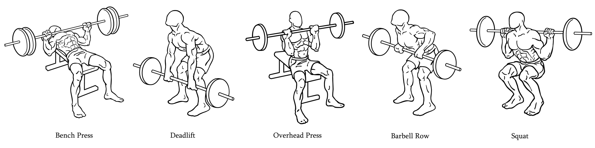
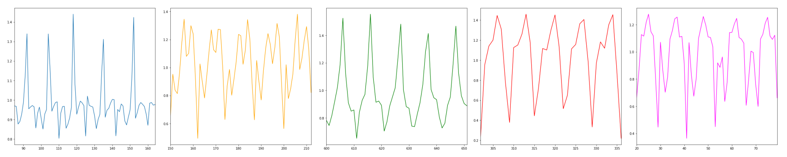

# Tracking Barbell Exercises
*Mini Master Project | Dave Ebbelaar | Vrije Universiteit Amsterdam*

This repository provides all the code to process, visualize, and classify accelerometer and gyroscope data obtained from [Mbientlab's WristBand Sensor Research Kit](https://mbientlab.com/). The data was collected during gym workouts where participants were performing various barbell exercises.

#### Exercises

#### Goals
* Classify barbell exercises
* Count repetitions
* Detect improper form 

#### Installation
Create and activate an anaconda environment and install all package versions using `conda install --name <EnvironmentName> --file conda_requirements.txt`. Install non-conda packages using pip: `pip install -r pip_requirements.txt`.

#### References
The original code is associated with the book titled "Machine Learning for the Quantified Self"
authored by Mark Hoogendoorn and Burkhardt Funk and published by Springer in 2017. The website of the book can be found on [ml4qs.org](https://ml4qs.org/).

> Hoogendoorn, M. and Funk, B., Machine Learning for the Quantified Self - On the Art of Learning from Sensory Data, Springer, 2017.

